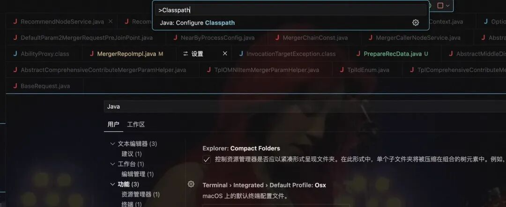
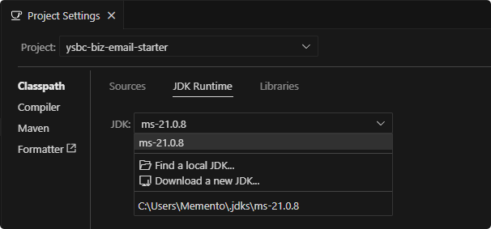
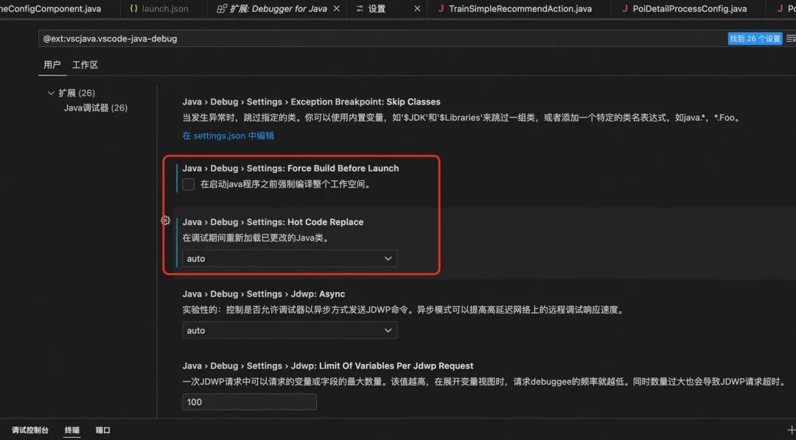
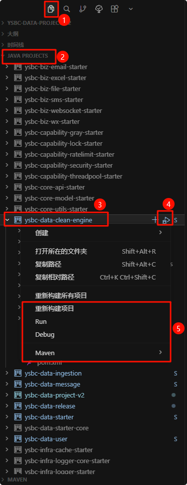
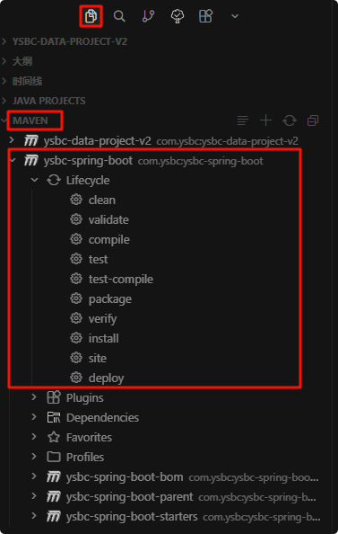

## 安装插件

- Extension Pack for Java（集合包）
  - Language support for Java ™ for Visual Studio Code
  - Debugger for Java
  - Test Runner for Java
  - Maven for Java
  - Project Manager for Java
  - Gradle for Java
- MyBatis Helper（Greenplumwine）

> 建议屏蔽不要安装： java-oracle 版本

## 项目配置

### settings.json（基础配置）

> 位于项目的 .vscode/settings.json

```json
{
  // maven 视图: 分层
  "maven.view": "hierarchical",

  // 启动窗口、打开文件夹、保存文件时的自动编译开关
  // 影响启动速度，如有需要可启动后再手动打开
  // 打开后，启动窗口，打开文件夹时会编译一次项目，耗时1.5-5分钟, 因此不建议打开
  "java.autobuild.enabled": false,
  // 设置内存大小
  "java.jdt.ls.vmargs": "-XX:+UseParallelGC -XX:GCTimeRatio=4 -XX:AdaptiveSizePolicyWeight=90 -Dsun.zip.disableMemoryMapping=true -Xmx8G -Xms2G -Xlog:disable",
  // 构建失败继续:开启
  "java.debug.settings.onBuildFailureProceed": true,
  // debug启动时自动编译:关闭
  // 如果打开，则应用启动前需要编译整个项目，耗时1.5-5分钟
  // 建议手工编译，可提升启动速度
  "java.debug.settings.forceBuildBeforeLaunch": false,
  // debug 自动加载修改后的类
  "java.debug.settings.hotCodeReplace": "auto",
  // null分析:关闭
  "java.compile.nullAnalysis.mode": "disabled",
  // JAVA 项目层级展示
  "java.dependency.packagePresentation": "hierarchical",

  // 问题装饰:关闭
  "problems.decorations.enabled": false,

  // 未使用变量: 隐藏
  "editor.showUnused": false,
  // 自动保存: 延迟
  "files.autoSave": "afterDelay",
  // 自动保存延迟时间: 3000毫秒
  "files.autoSaveDelay": 3000,
  "java.project.explorer.showNonJavaResources": true,
  "java.configuration.updateBuildConfiguration": "automatic",
  // 常用 maven 命令
  "maven.terminal.favorites": [
    {
      "command": "clean install deploy",
      "debug": false
    },
    {
      "command": "clean compile",
      "debug": false
    },
    {
      "command": "clean compile install",
      "debug": false
    },
    {
      "command": "clean compile install deploy",
      "debug": false
    }
  ]
}
```

### launch.json（调试配置）

```json
{
  "version": "0.2.0",
  "configurations": [
    {
      "type": "java",
      "name": "ysbc-data-clean-engine",
      "request": "launch",
      "mainClass": "com.ysbc.data.clean.engine.CleanEngineApplication",
      "projectName": "ysbc-data-clean-engine",
      "cwd": "${workspaceFolder}/java/src/ysbc-data-clean-engine",
      "args": "",
      "vmArgs": "-Xms256m -Xmx4G -Dlog.level.console=info -Dapollo.configService=http://192.168.0.147:8080 -Denv=TEST",
      "preLaunchTask": "maven: compile ysbc-data-clean-engine"
    }
  ]
}
```

### tasks.json（任务配置）

- preLaunchTask：执行前置任务，比如先编译再启动项目，对应 tasks.json 文件配置的任务

```json
{
  "version": "2.0.0",
  "tasks": [
    {
      "label": "maven: compile ysbc-data-clean-engine",
      "type": "shell",
      "command": "mvn",
      "args": ["clean", "compile", "-DskipTests"],
      "options": {
        "cwd": "${workspaceFolder}/java"
      },
      "group": {
        "kind": "build",
        "isDefault": false
      }
    }
  ]
}
```

启动窗口, 打开文件夹或保存问津时触发自动编译 - 自动编译选型
可以考虑在 settings.json 里的补充以下设置

```json
    //启动窗口、打开文件夹、保存文件时的自动编译开关
    //影响启动速度，如有需要可启动后再手动打开
    //打开后，启动窗口，打开文件夹时会编译一次项目，耗时1.5-5分钟
    //因此不建议打开
    "java.autobuild.enabled": false,
```

## 选择 JDK

`command + shift + p` 搜索 `classpath`





如果启动报错 diamond serverlist 未加载成功，是 jdk 版本太低

#### debug 配置 - 应用启动前的强制自动编译

电脑性能好的可以试试



等价于配置

```json
    //启动窗口、打开文件夹、保存文件时的自动编译开关
    //影响启动速度，如有需要可启动后再手动打开
    "java.autobuild.enabled": true,
    //debug应用启动自动编译:打开
    //如果打开，则应用启动前需要编译整个项目，耗时1.5-5分钟
    //建议手工编译，可提升启动速度
    "java.debug.settings.forceBuildBeforeLaunch": true,
    //denig自动加载修改后的类
    "java.debug.settings.hotCodeReplace": "auto",
```

## 编译/调试/启动 Spring boot 项目



在 JAVA PROJECTS 标签下，可以看到所有项目，在项目上右键③弹窗里，可以选择
●重新构建项目
●Run
●Debug
●Maven 命令
也可以直接在④点击调试项目
对应执行的就是在 launch.json 里的项目配置

## maven 打包发版


同 idea 上操作

## 控制台日志中文乱码(cmd.exe)

1.按 Win+R，输入 regedit 打开注册表编辑器 2.导航到：HKEY_LOCAL_MACHINE\SOFTWARE\Microsoft\Command Processor 3.右键 → 新建 → 字符串值 4.名称：Autorun 5.数值数据：chcp 65001 6.重启 Cursor
