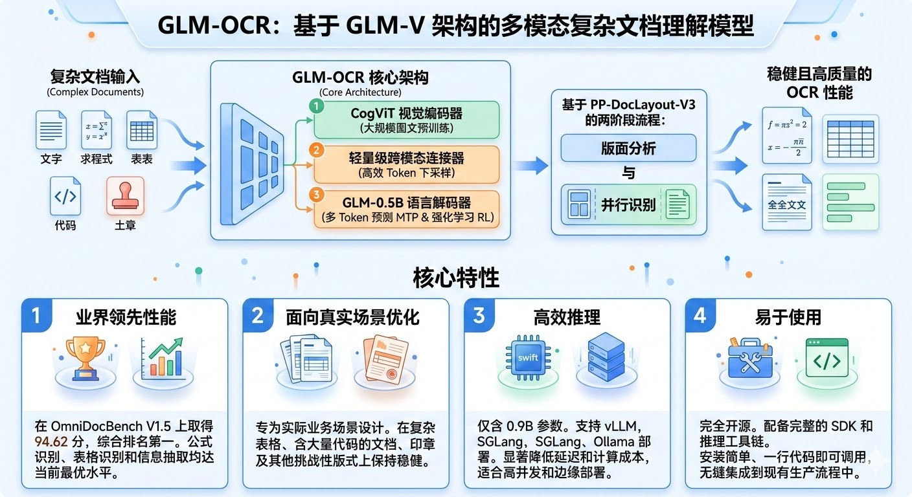
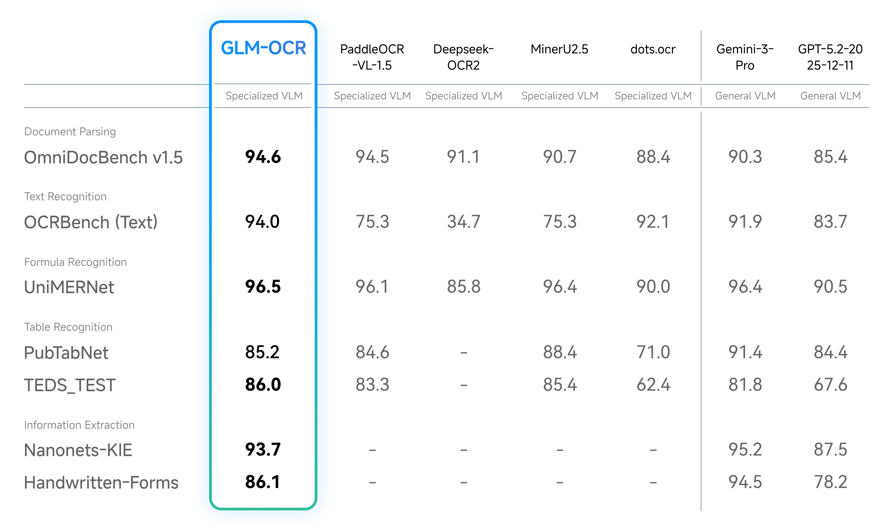
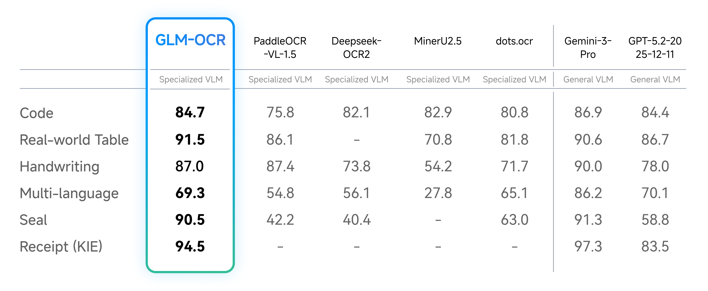
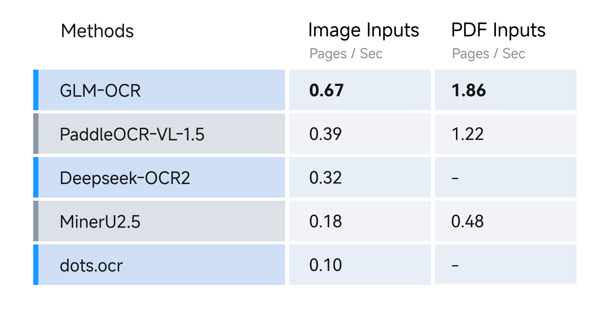

## 模型介绍

GLM-OCR 是一款面向复杂文档理解的多模态 OCR 模型，由智谱AI开发。它基于 GLM-V 编码器-解码器架构构建，具有以下核心特性：

**关键特性：**

- **业界领先效果**：在 OmniDocBench V1.5 上取得 94.62 分，综合排名第一；在公式识别、表格识别、信息抽取等主流文档理解基准上达到 SOTA 水平
- **高效推理**：总参数量仅 0.9B，支持通过 vLLM、SGLang 与 Ollama 部署，显著降低推理时延与算力成本
- **面向真实场景优化**：在复杂表格、代码密集文档、印章等各类高难版面场景中保持稳定表现
- **上手简单**：全面开源，提供完整 SDK 与推理工具链，支持便捷安装与一行调用

**成本优势**：相比传统 OCR 方案（如 PaddleOCR），GLM-OCR 具有更强的通用能力和更好的准确率，成本约为传统方案的 1/10。

### 性能演示









## vLLM 部署（生产环境推荐）

vLLM 提供高效的大模型推理框架，支持多种硬件加速和并发管理，是生产环境的首选方案。

### 安装 vLLM

```bash
# 安装最新版本的 vLLM（支持多种后端）
pip install -U vllm --torch-backend=auto --extra-index-url https://wheels.vllm.ai/nightly

# 或使用 Docker（推荐用于生产环境）
docker pull vllm/vllm-openai:nightly
```

### 安装依赖

如果不使用 Docker，需要单独安装 transformers 源码版本以获得最新特性支持：

```bash
pip install -U git+https://github.com/huggingface/transformers.git
```

### 启动服务

**基础启动（单卡）：**

```bash
vllm serve zai-org/GLM-OCR \
  --allowed-local-media-path / \
  --port 8080
```

**生产环境启动（启用 MTP 推测解码，性能更优）：**

```bash
vllm serve zai-org/GLM-OCR \
  --allowed-local-media-path / \
  --port 8080 \
  --speculative-config '{"method": "mtp", "num_speculative_tokens": 1}' \
  --served-model-name glm-ocr
```

**多 GPU 启动（tensor parallel）：**

```bash
vllm serve zai-org/GLM-OCR \
  --allowed-local-media-path / \
  --port 8080 \
  --tensor-parallel-size 2  # 根据 GPU 数量调整
```

### 配置说明

| 参数                         | 说明                     | 示例值                                           |
| ---------------------------- | ------------------------ | ------------------------------------------------ |
| `--allowed-local-media-path` | 允许加载的本地文件路径   | `/` 表示允许所有路径                             |
| `--port`                     | 服务监听端口             | `8080`                                           |
| `--speculative-config`       | 推测解码配置，提升性能   | `{"method": "mtp", "num_speculative_tokens": 1}` |
| `--tensor-parallel-size`     | 张量并行度（多卡时使用） | `2/4` 等                                         |
| `--max-model-len`            | 最大上下文长度           | 根据显存调整                                     |

## SGLang 部署

SGLang 是一款轻量级的大模型服务框架，相比 vLLM 启动速度更快，特别适合快速原型开发和测试环境。

### 安装 SGLang

**方式 1：Docker 安装（推荐）：**

```bash
docker pull lmsysorg/sglang:dev
```

**方式 2：从源码安装：**

```bash
pip install git+https://github.com/sgl-project/sglang.git#subdirectory=python
```

### 安装依赖

同样需要最新的 transformers：

```bash
pip install -U git+https://github.com/huggingface/transformers.git
```

### 启动服务

**基础启动：**

```bash
python -m sglang.launch_server \
  --model zai-org/GLM-OCR \
  --port 8080
```

**启用 NEXTN 推测解码（推荐，性能更优）：**

```bash
python -m sglang.launch_server \
  --model zai-org/GLM-OCR \
  --port 8080 \
  --speculative-algorithm NEXTN \
  --speculative-num-steps 1 \
  --served-model-name glm-ocr
```

**多 GPU 启动：**

```bash
python -m sglang.launch_server \
  --model zai-org/GLM-OCR \
  --port 8080 \
  --tp-size 2  # 根据 GPU 数量调整
```

### vLLM vs SGLang 对比

| 特性       | vLLM     | SGLang    |
| ---------- | -------- | --------- |
| 启动速度   | 较慢     | 快        |
| 性能       | 优秀     | 优秀      |
| 功能完整性 | 完整     | 轻量      |
| 推荐场景   | 生产环境 | 开发/测试 |
| 并发处理   | 强大     | 良好      |

**选择建议：** 生产环境优先使用 vLLM；快速开发和测试使用 SGLang。

## Ollama 部署

Ollama 提供最简单的本地部署方案，适合快速体验和个人开发者使用。

### 安装 Ollama

访问 [Ollama 官网](https://ollama.ai) 下载对应系统版本的安装程序。

### 使用 Ollama

```bash
# 下载 GLM-OCR 模型
ollama pull glm-ocr

# 直接运行模型进行交互式对话
ollama run glm-ocr

# 识别图片中的文本
ollama run glm-ocr "请识别图片中的文本" /path/to/image.png

# 指定输出格式（JSON）
ollama run glm-ocr "请识别图片中的文本，并以 JSON 格式输出" /path/to/image.png
```

### 启动 Ollama API 服务

```bash
# Ollama 默认在后台运行 API 服务（localhost:11434）
# 如需调用 REST API，可以直接发送请求

curl http://localhost:11434/api/generate \
  -X POST \
  -H "Content-Type: application/json" \
  -d '{
    "model": "glm-ocr",
    "prompt": "请识别图片中的文本"
  }'
```

## 三种部署方案对比

| 方案       | 难度 | 性能 | 推荐场景  | 优点                            | 缺点               |
| ---------- | ---- | ---- | --------- | ------------------------------- | ------------------ |
| **vLLM**   | 中   | 最优 | 生产环境  | 性能好、funcall丰富、并发能力强 | 配置复杂、启动较慢 |
| **SGLang** | 低   | 优秀 | 开发/测试 | 启动速度快、配置简单            | 功能相对轻量       |
| **Ollama** | 最低 | 中等 | 个人开发  | 安装简单、开箱即用              | 性能一般、功能有限 |

**推荐选择：**

- 企业级生产环境 → **vLLM**
- 快速原型开发 → **SGLang**
- 个人学习体验 → **Ollama**

## 部署前准备

在部署 GLM-OCR 之前，请确保你的系统满足以下要求：

### 硬件要求

| 配置项   | 最低要求      | 推荐配置                       |
| -------- | ------------- | ------------------------------ |
| **CPU**  | 4 核          | 8 核及以上                     |
| **内存** | 8GB           | 16GB 或以上                    |
| **GPU**  | 无（支持CPU） | NVIDIA GPU（12GB VRAM 及以上） |
| **存储** | 20GB          | 30GB 以上（预留模型空间）      |

### 软件环境

- **Python**：3.8, 3.9, 3.10, 3.11, 3.12
- **操作系统**：Linux（推荐 Ubuntu 20.04 LTS）、Windows、macOS（仅支持 CPU 或 Apple Silicon）
- **显卡驱动**：如使用 GPU，需安装最新 NVIDIA 驱动和 CUDA 工具链

### 环境检查

```bash
# 检查 Python 版本
python --version

# 检查 CUDA 可用性（如有 GPU）
nvidia-smi

# 检查显卡显存（按需）
# 命令输出中查看 "memory.total" 字段
```

## SDK 安装与使用

### 方式 1：MaaS API（云端托管，推荐快速上手）

无需 GPU，直接使用智谱云端托管的 GLM-OCR 服务。

**安装 SDK：**

```bash
# 从源码安装
git clone https://github.com/zai-org/glm-ocr.git
cd glm-ocr
pip install -e .
```

**配置 API Key：**

1. 在 [https://open.bigmodel.cn](https://open.bigmodel.cn) 申请 API Key
2. 创建 `config.yaml` 配置文件：

```yaml
pipeline:
  maas:
    enabled: true # 启用 MaaS 模式
    api_key: your-api-key # 替换为你的 API Key
```

**使用方式：**

```python
from glmocr import parse

# 便捷函数方式
result = parse("image.png")
result = parse(["img1.png", "img2.jpg"])  # 处理多页
result = parse("https://example.com/image.png")  # 支持 URL
result.save(output_dir="./results")

# 获取结果
print(result.json_result)   # JSON 格式结果
print(result.markdown_result)  # Markdown 格式结果
```

### 方式 2：本地自部署（vLLM/SGLang）

完全私有化部署，掌控数据安全。

**安装 SDK：**

```bash
git clone https://github.com/zai-org/glm-ocr.git
cd glm-ocr
pip install -e .
```

**配置本地服务：**

```yaml
pipeline:
  maas:
    enabled: false # 禁用云端 API
  ocr_api:
    api_host: localhost # 本地服务地址
    api_port: 8080 # 服务端口
    connect_timeout: 300
    request_timeout: 300
```

**使用方式：**

```python
from glmocr import GlmOcr, parse

# 使用类接口（推荐用于长期运行）
with GlmOcr() as parser:
    result = parser.parse("image.png")
    print(result.json_result)
    result.save()

# 或使用便捷函数
result = parse("image.png")
result.save(output_dir="./results")
```

### CLI 命令

```bash
# 解析单张图片
glmocr parse examples/source/code.png

# 解析整个目录
glmocr parse examples/source/

# 指定输出目录
glmocr parse examples/source/code.png --output ./results/

# 使用自定义配置
glmocr parse examples/source/code.png --config my_config.yaml

# 启用 DEBUG 日志（包含性能分析）
glmocr parse examples/source/code.png --log-level DEBUG
```

### Flask 服务

如需提供 HTTP API 服务：

```bash
# 启动 Flask 服务
python -m glmocr.server

# 开启 DEBUG 日志
python -m glmocr.server --log-level DEBUG
```

**调用示例：**

```bash
curl -X POST http://localhost:5002/glmocr/parse \
  -H "Content-Type: application/json" \
  -d '{"images": ["./example/source/code.png"]}'
```

## 常见问题与解决方案

### 1. 模型下载缓慢

**原因：** Hugging Face 下载速度慢

**解决方案：**

```bash
# 设置国内镜像源
export HF_ENDPOINT=https://hf-mirror.com

# 或在代码中设置
import os
os.environ['HF_ENDPOINT'] = 'https://hf-mirror.com'
```

### 2. GPU 显存不足

**错误信息：** `RuntimeError: CUDA out of memory`

**解决方案：**

```bash
# vLLM 启动时限制最大上下文长度
vllm serve zai-org/GLM-OCR \
  --allowed-local-media-path / \
  --port 8080 \
  --max-model-len 2048  # 根据显存调整

# 或启用量化
vllm serve zai-org/GLM-OCR \
  --allowed-local-media-path / \
  --port 8080 \
  --quantization awq  # 或 gptq
```

### 3. 连接超时

**原因：** 模型首次加载耗时长

**解决方案：**

```yaml
# 增加超时时间
pipeline:
  ocr_api:
    connect_timeout: 600 # 增大超时时间（秒）
    request_timeout: 600
```

### 4. 识别率低

**原因：** 图片质量差、分辨率低

**优化方案：**

- 确保图片清晰度足够（建议 DPI >= 150）
- 避免倾斜的文档，使用自动纠正
- 对于异体字、特殊符号可能识别不准，建议后处理

### 5. Docker 镜像拉取失败

**解决方案：**

```bash
# 配置 Docker 加速镜像（以阿里云为例）
{
  "registry-mirrors": [
    "https://cr.console.aliyun.com"
  ]
}
```

编辑 `/etc/docker/daemon.json` 后重启 Docker。

### 6. transformers 安装失败

**解决方案：**

```bash
# 使用清华源
pip install -i https://pypi.tuna.tsinghua.edu.cn/simple git+https://github.com/huggingface/transformers.git
```

## 参考资料

**官方资源：**

- [GLM-OCR GitHub 项目](https://github.com/zai-org/GLM-OCR)
- [GLM-OCR 官方 README](https://github.com/zai-org/GLM-OCR/blob/main/README_zh.md)
- [GLM-OCR 官方 API 文档](https://docs.bigmodel.cn/cn/guide/models/vlm/glm-ocr)
- [阿里云 ModelScope 模型链接](https://www.modelscope.cn/models/ZhipuAI/GLM-OCR)
- [Hugging Face 模型](https://huggingface.co/zai-org/GLM-OCR)

**推理框架：**

- [vLLM 官方文档](https://docs.vllm.ai)
- [SGLang 官方文档](https://github.com/sgl-project/sglang)
- [Ollama 官方网站](https://ollama.ai)

**教程与指南：**

- [0.9B 小模型，OCR 大能力——GLM-OCR 模型实战教程](https://developer.aliyun.com/article/1712888)
- [GLM-OCR 部署全攻略：0 基础搭高性能文字识别服务](https://blog.csdn.net/iFisher666/article/details/158616088)

**环境优化：**

- 如遇到下载速度慢，可设置 HF_ENDPOINT 为 `https://hf-mirror.com`
- 国内 PyPI 镜像：`https://pypi.tuna.tsinghua.edu.cn/simple`
